# Leonard-Bot
Leonard Bot Mechanical Design Updates

## 1. Inventor 3D Model (Mel 12 hours)

### 1.1 How to create new frame profile (Mel 4 hrs)

1. Click the setting button
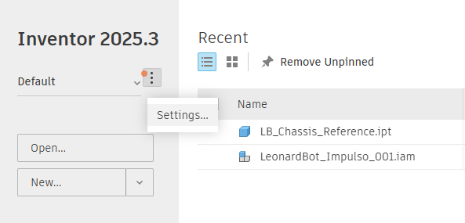

2. Click the Configure Content Center Libraries 
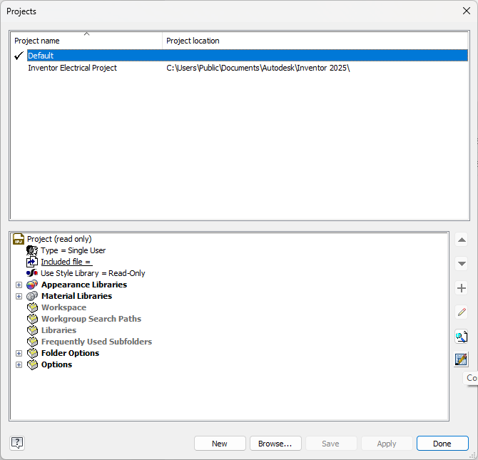

3. Click Create Library
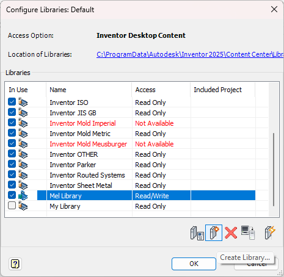

4. Create a sketch for the profile
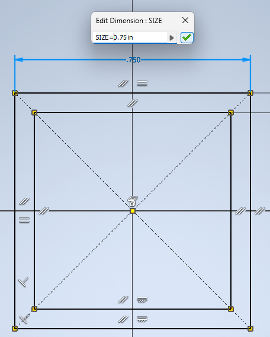

5. Extrude the sketch, the dimension does not matter, e.g., 0.0000001 mm
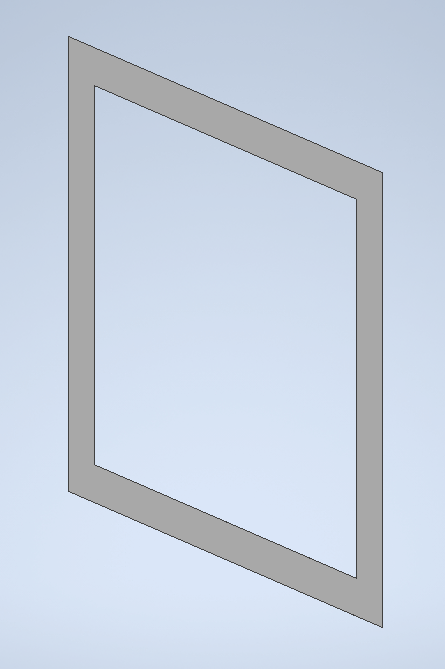

6. For each dimension, create a parameter, e.g., SIZE=0.75in
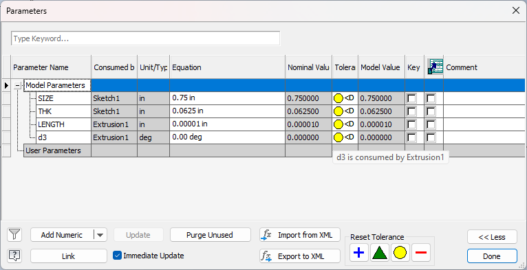

7. Click Content Center Editor
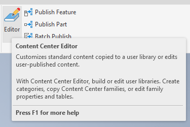

8. Copy the Category Structure of a Default Library, e.g. ANSI, to the new library
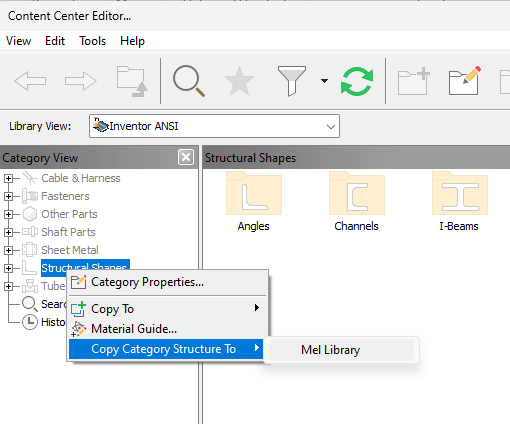

9. To verify, click Category Properties
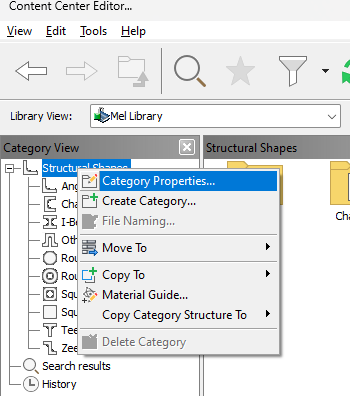

10. If the copy was succesfull, you will see a table filled with units for each category
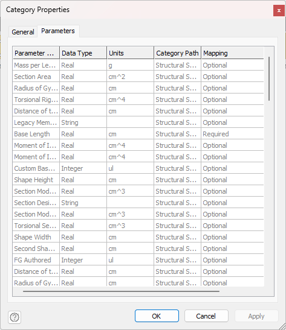

11. Go to Manage/Structural Shape
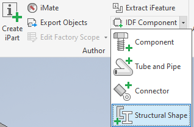

12. Click the Notch Profile option and select the outer and inner regions of the profile
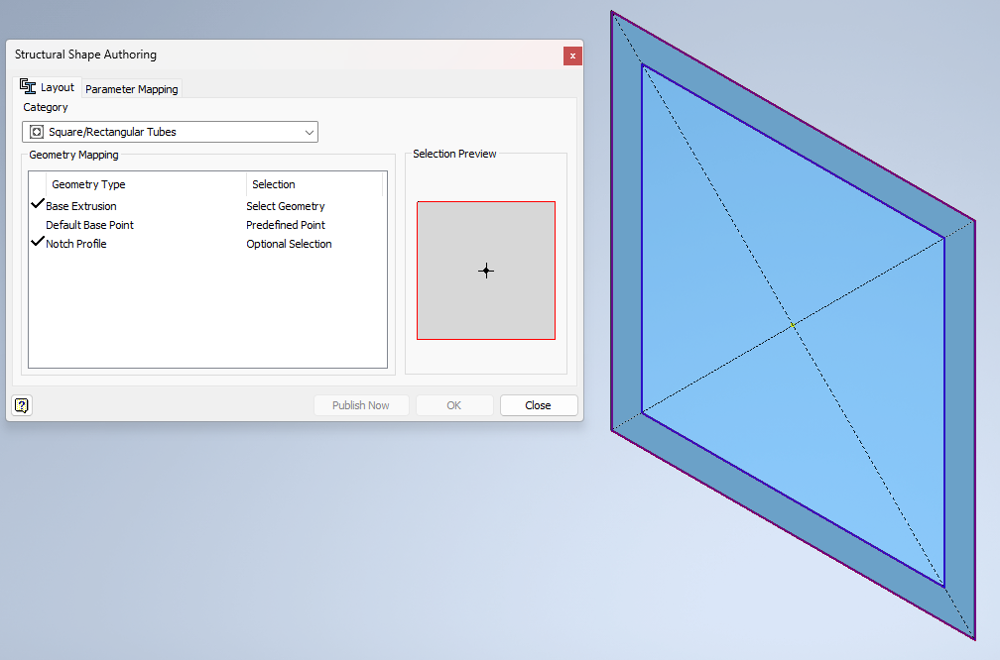

13. Now, include the template parameters into the corresponding category properties, e.g. LENGTH goes to Base Length 
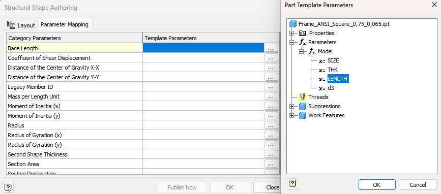

14. SIZE goes to Shape Width
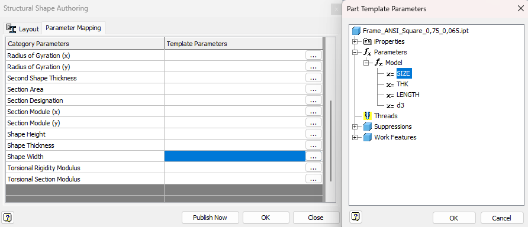

15. THK goes to Shape Thickness
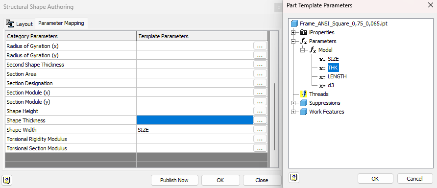

16. Click Publish Now and select the new library
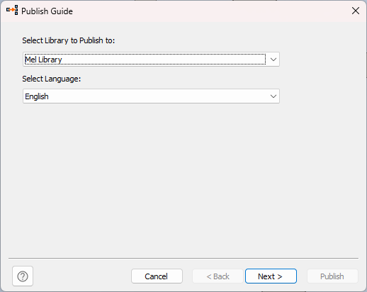

17. Select Square/Rectangular Tubes
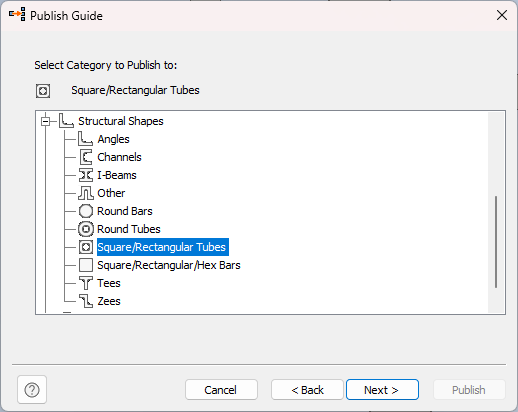

18. Select Shape Width and Shape Thickness as the Key Columns
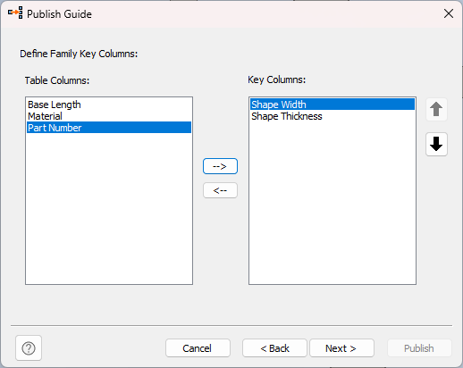

19. Set your custom Family Properties
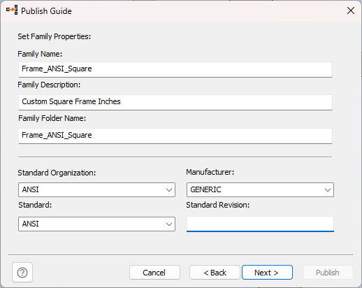

20. Set Family Thumbnail Image or leave the default
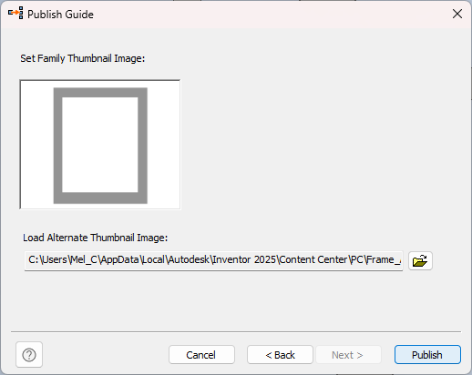

21. The new structural member should appear in the new library
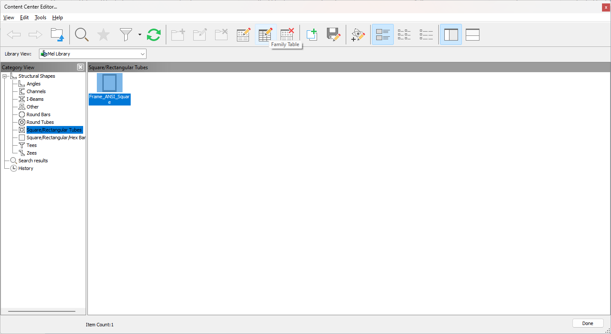

22. Right click and select Family Table. Then configure the Part Number Column
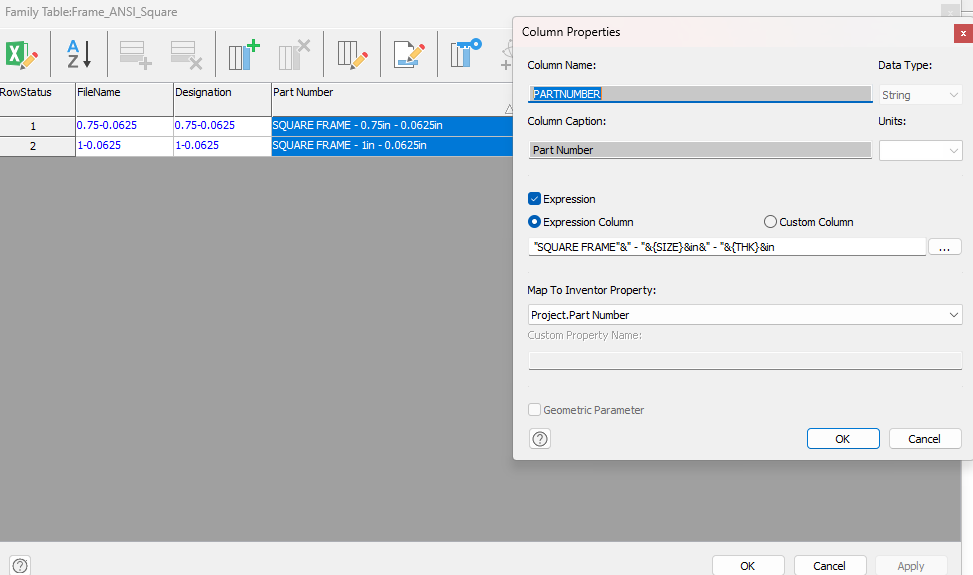

23. Add rows for new profile dimensions
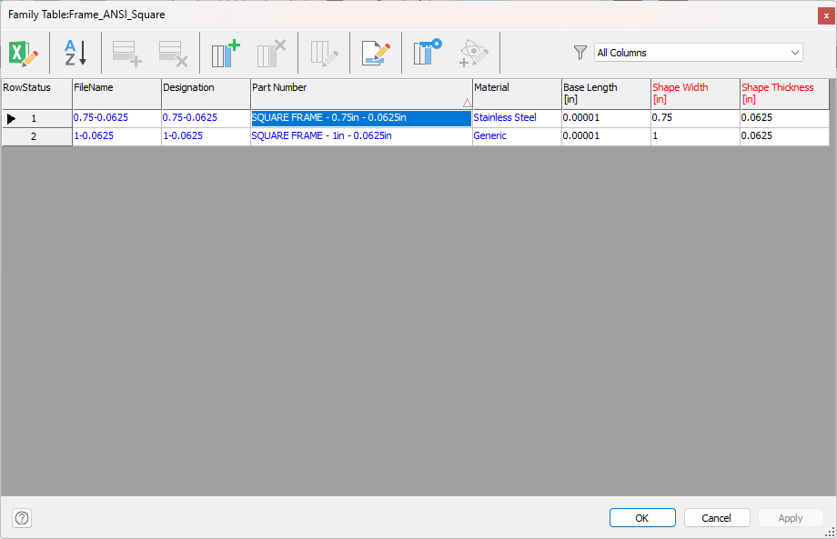

24. Go to Tools/Application Options
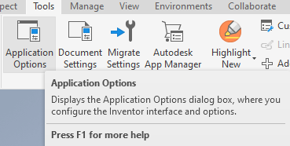

25. Click the File Naming Defaults option
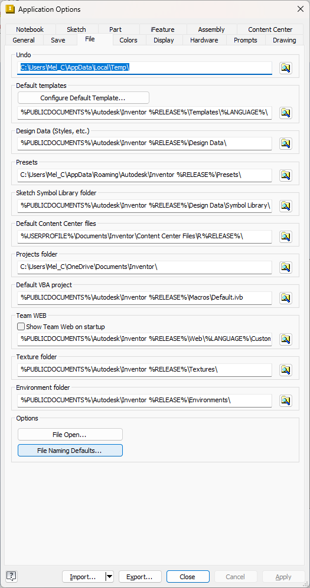

26. You can change the default Frame Member Parts Names when created
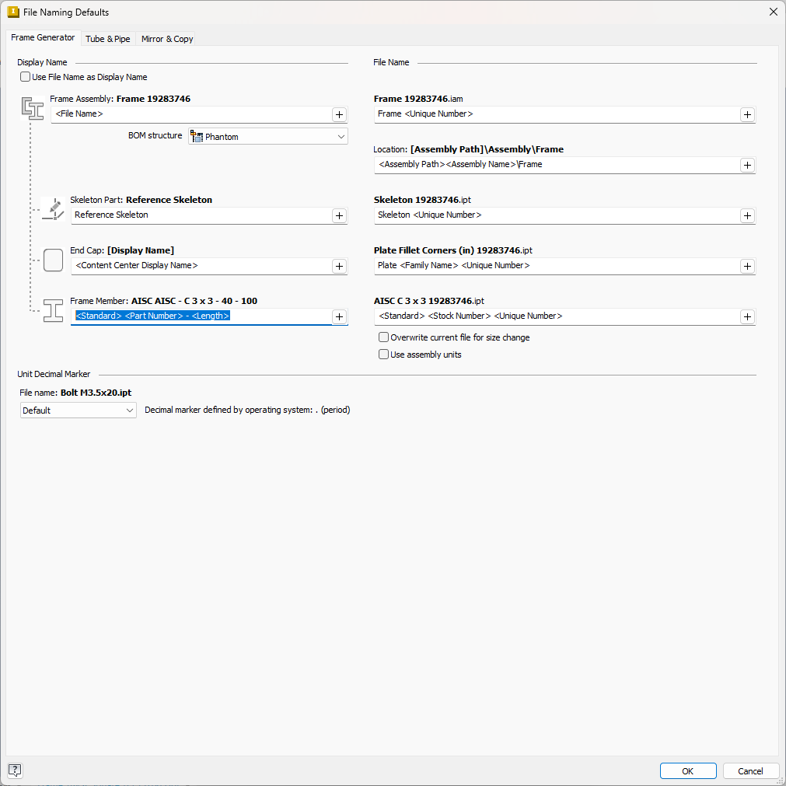

### 1.2 Chassis Design (Mel 2 hrs)
First, create the Chassis Skeleton
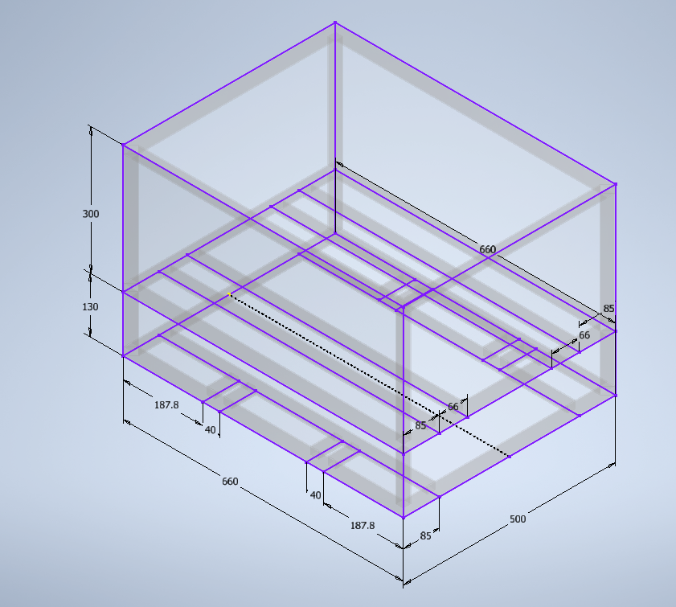

Then, with the Insert Frame operation create the chassis with the new profile cross section
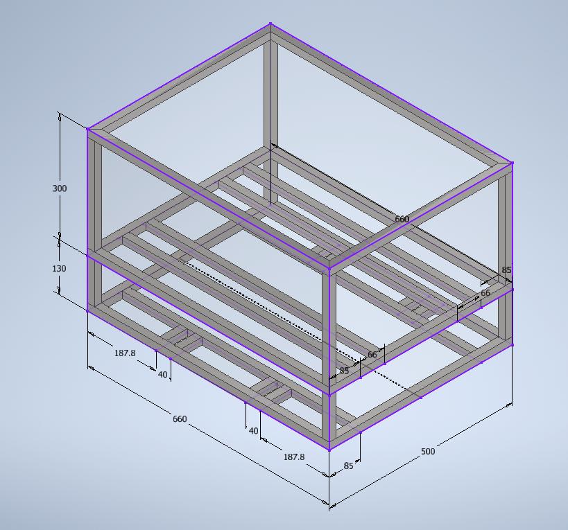

### 1.3 Library Components (Mel 2 hrs)
Download libraries from GrabCAD and 3DFindit. Here, a list of all the downloaded components will be updated as the design is improved.

Electronic Components
- LB_DC_Fan_40x40x10mm
- LB_Nema_23_Mounting_Bracket
- LB_Stepper_Motor_Nema_23HS45_4204
- LB_Supply_Power_12V
- LB_TB6600_Motor Drive

Mechanical Components
- LB_Ball_Nut_Housing bracket_SFU1605
- LB_Ball_Screw_Nut_1605
- LB_Ball_Screw_SFU1605_1000mm
- LB_BF12_Floating_Ballscrew_Support
- LB_BK12_Fixed_Ballscrew_Support
- LB_Rail_Guide_SBR16_1000mm
- SBR16UU_Open_Linear_Bearing
- LB_NexusRobot_Mecanum_Wheel_14101

### 1.4 First Stage Design (Mel 1 hour)
For the first stage, only L-profile beams were modeled, the rest are library components.

### 1.5 Constrain Mates (Mel 3 hours)
For the Constrain Mates some Planes and Axis were created to set the position and orientation.

### 1.6 Create Project File (Mel 1 hour)
In order to share the Inventor Assembly from a local computer to another, a project should be created to avoid errors. Thus I watched the following tutorial on
Youtube which explains thoroughly why Project Files are important and how to configure them: https://www.youtube.com/watch?v=hhPYpD2Rwmo&t=1s&pp=ygUWcHJvamVjdCBmaWxlcyBpbnZlbnRvcg%3D%3D

## 2. Mecanum Wheel Selection (Mel 3 hours)
Since we were unsure about which wheels will be utilized, I decided to have a list of all the potential mecanum wheels we can buy online.
I found out that the two most popular seller companies are NexusRobot and AndyMark. The former one sells its mecanum wheels via Alixpress, so I
created an Excel table with Name, Max Payload, Outer Diameter, Price and Links as columns.

Here is the link to the Excel Sheet: https://docs.google.com/spreadsheets/d/1BFJV8bbEpI99eMvAq6Wxt-B6WSqNnhPT/edit?usp=sharing&ouid=115723066088232837866&rtpof=true&sd=true

## 3. Mecanum Wheel Dynamics (Mel 20 hours)
In addition, I wanted to analyze the mechanical differences between omnidirectional and differential movements, thus I derived the Kinematic and Kinetic Equations for a Mecanum Wheel Robot.

Here is the link to the PDF document that shows my notes regarding the mechanic analysis: https://drive.google.com/file/d/1lVYsBrDlKZmKvKsWRgfK8u7zCmIDLQI_/view?usp=drive_link

## 4. Matlab Symbolic Toolbox (Mel 16 hours)
To validate my notes, I also utilized the Symbolic Toolbox from Matlab.

Here is the link to the Matlab Live Script that contains almost all the equations from my notes: https://drive.google.com/file/d/1H8AKplWCpQifrLUFWSNoIagcGq4D1q2j/view?usp=drive_link

To end this task, I need to verify with the Lagrangian method to know my approach is valid. Thus this task is 75% completed. Besides that, this task will be very useful to implement control theory.

## 5. Other Advancements

### 5.1 Impulso First Task  (2 hours)
For the first task, For the second task, I contributed to the redaction for 2 hours approximately.

### 5.2 Impulso Second Task (3 hours)
For the second task, I contributed to the redaction for 3 hours approximately.

### 5.3 UNIFIM Presentation (6 hours and a half)
For this task, I first spent 2 hours and a half with Jesus to elaborate the Canva presentation. Afterwards, I spent 4 hours that same day on Saturday in the evening to finish my part.